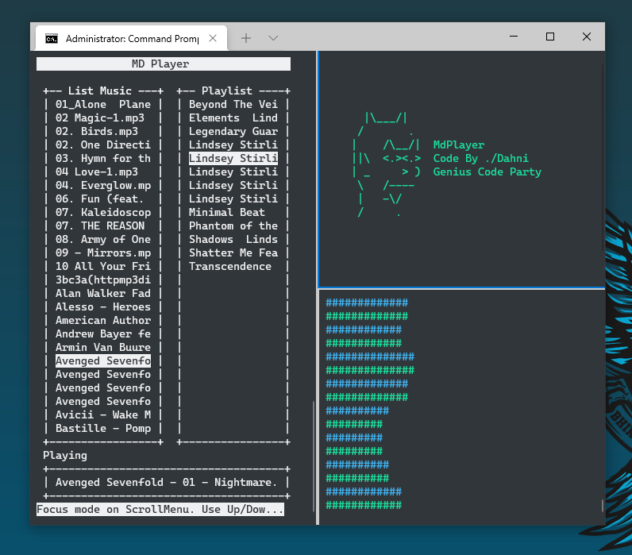

# mdPlayer
```
Support Python 3
```
Requirement Library
```
pip install py_cui
pip install pygame
```
after installed pygame, if you use os Windows, you must go to path library pygame and copy `libmpg123-0.dll` to Windows\System32
if you use Linux, install pulseaudio first



this tools still on development stage
